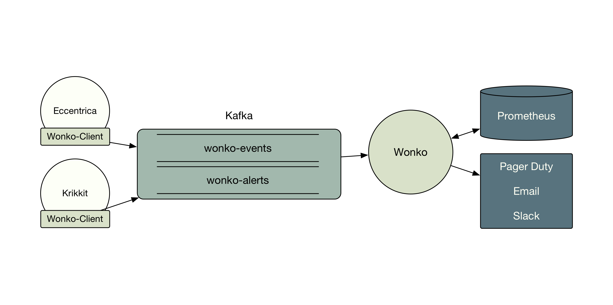

# Wonko

Monitoring and alerting service for all Staples SparX services.

## Integration

If you're looking to integrate your service with wonko, see https://github.com/StaplesLabs/wonko-client.

## How does it work?

- A service integrating with Wonko uses the wonko-client to send metrics to Wonko.
- Wonko reads off designated topics `wonko-alerts` and `wonko-events` in the central kafka cluster.
- It sends pager-duty alerts for events coming through `wonko-alerts`. Each service needs a configured pager-duty endpoint.
- It creates prometheus objects for all metrics and exposes an endpoint per service for prometheus to poll.
- Prometheus polling and alerting is configured independently, outside of wonko.

## Histograms

The "stream" type for Prometheus now only uses a histogram. The bucket start/width/count values can be set through the wonko-client's options field. The call will look like:
`(wonko/stream :halloween-test-2 halloween-attrs 19 :bucket-count 15 :bucket-width 20)`
This call specifies that there should be 15 buckets of width 20.